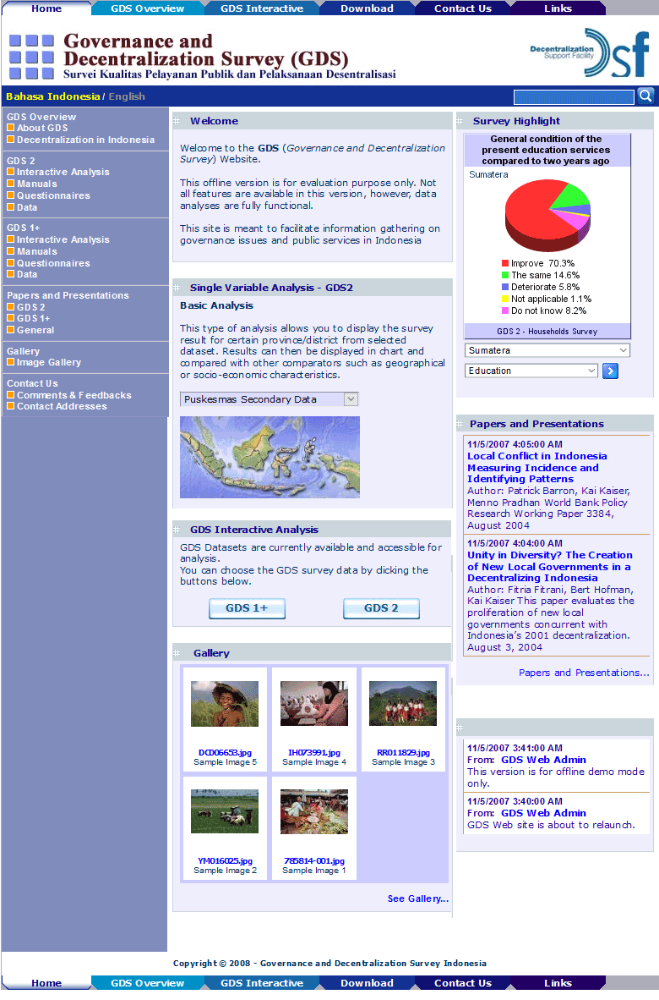
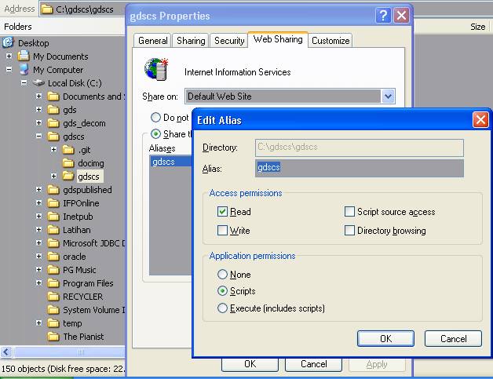
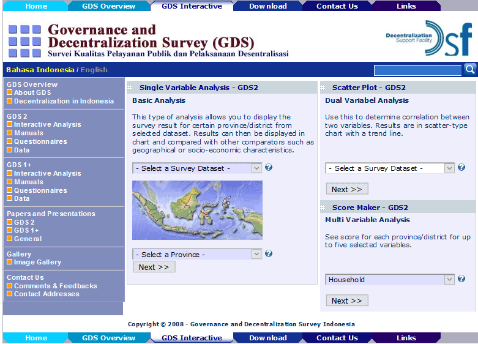
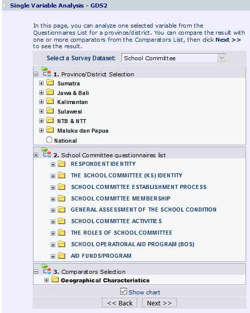
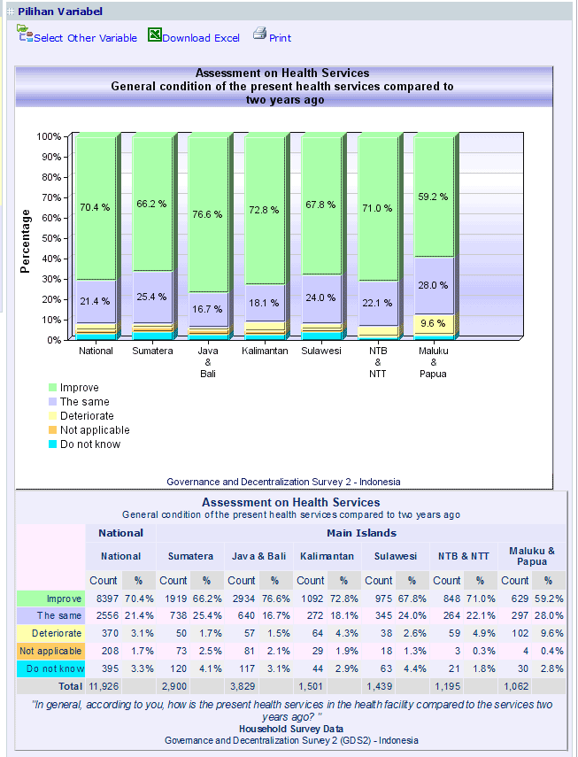
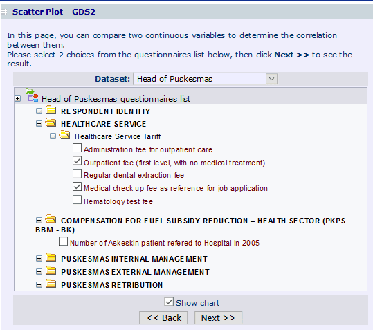
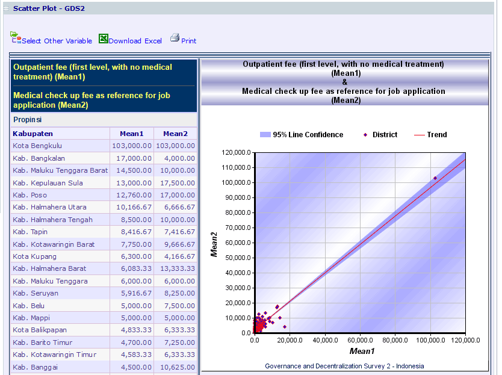
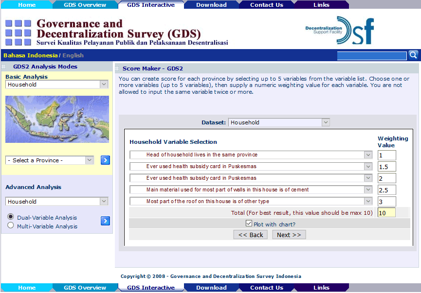
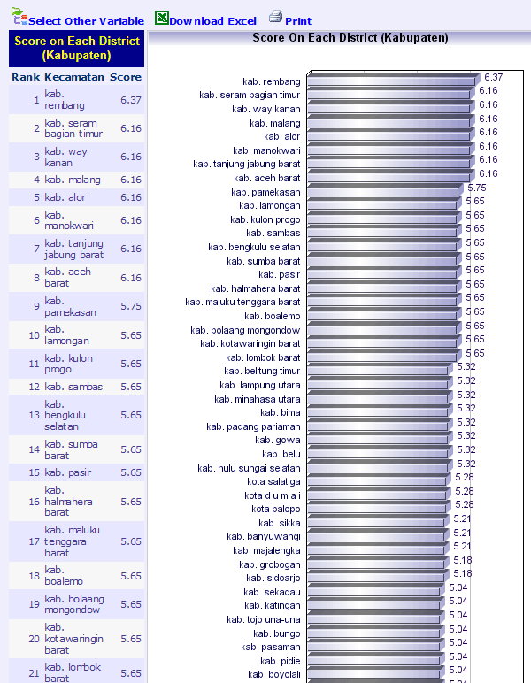

GDS-2 is a web based tool meant to facilitate data query on governance issues and public services in Indonesia.

##### Table of Contents

* [**Overview**](#overview)
* [**Requirements**](#requirements)
* [**Installation**](#installation)
  * [Database Installation](#database-installation)
  * [Source Code](#source-code)
* [**Analysis Modes**](#analysis-modes)
  * [Single Variable](#single-variable)
  * [Scatter Plot](#scatter-plot)
  * [Score Maker](#score-maker)

## Overview


GDS2 is an integrated survey of households, public health and education facilities, and district and village level officials. The survey instrument is designed to assemble detailed information on the provision of and use of local public services, as well as the governance environment in which those services are delivered and used. The GDS has been designed to complement a core of secondary data such as the Central Bureau of Statistics' household survey (SUSENAS), village census (PODES), and manufacturing census (Survey Industri) as well as the Ministry of Finance's local government finance data (SIKD). Three versions of the GDS (GDS1, GDS1+ and GDS2) have already been implemented; all waves are implemented by Center for Population and Policy Studies at the University of Gadjah Mada (CPPS-UGM).
## Requirements
1. .NET Framework 2.0 or newer.  Yes, this project is ancient. 
2. For development use Visual Studio 2010 or newer. You can [download the latest Visual Studio here](https://visualstudio.microsoft.com/downloads/).
3. Microsoft SQL Server 2000 Developer Version or higher. [Download SQL Server here](https://www.microsoft.com/en-us/sql-server/sql-server-downloads).
4. Windows XP or newer with IIS installed.

## Installation
1. Direct download the [published release version here](https://github.com/erlange/GDS-2-/releases/download/v1.0/gds2-rel.0.1.0.zip).
2. Create an IIS virtual directory and configure it as a web application. The easiest way is to right click the `gdscs` folder, click Properties of that folder, then go to the Web Sharing and choose Share This Folder option tab as shown in this figure. Click OK to close the Properties window.



For further info on how to Install IIS and configure an ASP.NET you can [read here](https://docs.microsoft.com/en-us/iis/application-frameworks/scenario-build-an-aspnet-website-on-iis/configure-an-asp-net-website-on-iis).
3. You should be able to browse to `http://localhost/gdscs` from your browser.

### Database Installation
The GDS2 database size is huge and Github doesn't allow big file to be hosted in its repositories, so I stored the database in DropBox instead.

1. Download the backup file [from DropBox here](https://www.dropbox.com/s/qz1qdorm3k89uwe/gds.zip) and extract the zip file.
2. Restore it to your SQL Server

```
RESTORE DATABASE gds 
  FROM DISK = 'C:\YourLocalDirectory\gds.bak' 
```

### Source Code
* Download the [ZIP file](https://github.com/erlange/GDS-2-/archive/master.zip) or clone this repository:
```
mkdir [your-directory]
cd [your-directory]
git clone https://github.com/erlange/GDS-2-.git
```

You can then open the `.sln` and build the solution file with Visual Studio.


## Analysis Modes



GDS2 provides 3 types of query which enable you to further analyse the data.

### Single Variable


At the very basic this single variable analysis allows you to display the survey result for selected region from selected dataset.



Results can then be displayed in chart and compared with other comparators such as geographical or socio-economic characteristics


### Scatter Plot



Use this to determine correlation between two continuous (numeric) variables. 



Results will then be displayed in scatter-type chart with a trend line.


### Score Maker



Use this to score each region for up to five custom-weighted continuous (numeric) variables.


